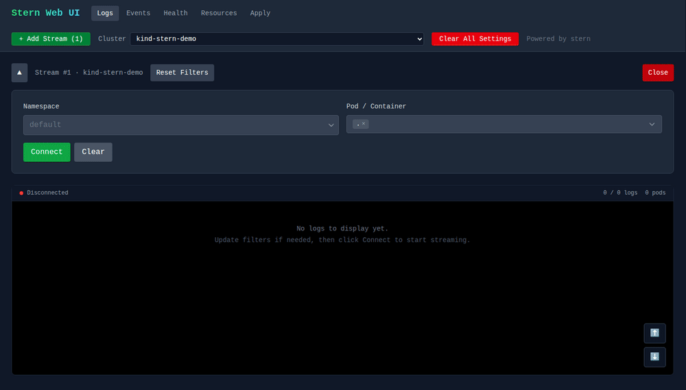
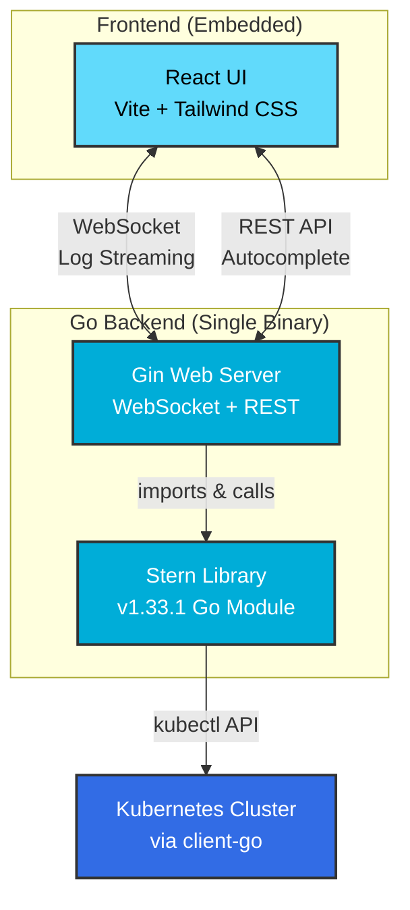

# Stern Web UI

A modern web interface for [stern](https://github.com/stern/stern), the multi-pod and container log tailing tool for Kubernetes.


## Features

- **Real-time Log Streaming** - WebSocket-based live log tailing across pods and containers
- **Multi-Stream Support** - Open multiple independent log streams, each with its own filters, context, and auto-reconnect state
- **Pod/Container Selector** - Pick a specific pod and container to tail, or leave it blank to follow all matching pods
- **Log Level Detection** - Automatic detection and color-coding of log levels (ERROR, WARN, INFO, DEBUG)
- **Pause/Resume** - Pause log streaming without dropping the connection
- **Cluster Events** - Browse cluster events with namespace filtering and per-event details
- **Cluster Health** - Node readiness and pod issue summary
- **Resource Browser** - Browse configmaps, secrets, RBAC roles/bindings, and workloads, with full YAML detail on click
- **Apply Manifests** - Apply or delete a YAML manifest directly from the UI
- **Persistent Settings** - Per-stream configuration saved to localStorage
- **Dark Theme** - Easy on the eyes for extended log watching sessions

## Screenshots




## Quick Start

### Using Taskfile (Recommended)

This project uses [Task](https://taskfile.dev) for task automation. Install it first:

```bash
# macOS
brew install go-task

# Linux
sh -c "$(curl --location https://taskfile.dev/install.sh)" -- -d -b ~/.local/bin

# Or via Go
go install github.com/go-task/task/v3/cmd/task@latest
```

View all available tasks:
```bash
task --list
```

**Main tasks:**
- `task test` - Run all tests (backend + frontend)
- `task build` - Build both backend and frontend
- `task run` - Build and run the complete application
- `task docker:build` - Build Docker image
- `task docker:run` - Run Docker container
- `task release -- [patch|minor|major] [--yes]` - Automated release process

### Prerequisites

- [Go 1.25+](https://golang.org/dl/)
- [Node.js 20+](https://nodejs.org/)
- [kubectl](https://kubernetes.io/docs/tasks/tools/) configured with cluster access

> **Note**: Stern is included as a Go module dependency and does not need to be installed separately.

### Local Development

1. **Clone the repository**
   ```bash
   git clone https://github.com/yourusername/stern-ui.git
   cd stern-ui
   ```

2. **Run the frontend dev server**
   ```bash
   task frontend:dev
   ```

3. **Run the backend** (in another terminal)
   ```bash
   task backend:run
   ```

4. **Open your browser** at `http://localhost:5173` (Vite dev server proxies to backend)

<details>
<summary>Alternative: Manual commands without Taskfile</summary>

```bash
# Frontend
cd frontend
npm install
npm run dev

# Backend (in another terminal)
go run main.go
```
</details>

### Production Build

The frontend is **embedded into the Go binary** for easy deployment as a single executable.

```bash
# Build both frontend and backend
task build

# Run the single binary - no external files needed!
task run
# Or directly: ./stern-ui
# Open http://localhost:8080
```

**Note**: The frontend must be built before building the Go binary, as the `go:embed` directive includes the `frontend/dist` directory at compile time.

<details>
<summary>Alternative: Manual build commands</summary>

```bash
# Build frontend
cd frontend
npm ci
npm run build
cd ..

# Build backend (frontend gets embedded automatically via go:embed)
go build -o stern-ui main.go

# Run
./stern-ui
```
</details>

## Docker

### Build the Image

```bash
task docker:build
```

### Run Locally with Docker

```bash
# Run interactively
task docker:run

# Or run in detached mode
task docker:run:detached

# View logs
task docker:logs

# Stop container
task docker:stop
```

For custom kubeconfig mounting:
```bash
docker run -p 8080:8080 \
  -v ~/.kube/config:/root/.kube/config:ro \
  stern-ui:latest
```

<details>
<summary>Alternative: Manual Docker commands</summary>

```bash
# Build
docker build -t stern-ui:latest .

# Run
docker run -p 8080:8080 \
  -v ~/.kube/config:/root/.kube/config:ro \
  stern-ui:latest
```
</details>

## Kubernetes Deployment

stern-ui runs anywhere with kubectl access. To deploy it inside your cluster, build the image and run it with your kubeconfig mounted:

```bash
# Run in-cluster with host kubeconfig mounted
docker run -p 8080:8080 \
  -v ~/.kube/config:/root/.kube/config:ro \
  stern-ui:latest
```

A `stern-ui.yaml` manifest (ServiceAccount, RBAC, Deployment, Service) was previously bundled but is no longer shipped; write your own manifest or run the single binary instead.

## Configuration Options

### Log Stream

| Parameter | Description | Default |
|-----------|-------------|---------|
| **Namespace** | Kubernetes namespace to tail logs from | - |
| **Pod / Container** | Specific pod/container to tail; empty follows all | all pods |

Each stream has its own configuration, saved to localStorage. The cluster context is selected globally in the header and applied to every stream.

## Architecture



**Key Points:**
- Frontend is **embedded** in Go binary via `//go:embed`
- Stern is used as a **Go library** (not CLI), imported from `github.com/stern/stern/stern`
- Single binary deployment with no external dependencies except kubectl config
### API Endpoints

| Endpoint | Method | Description |
|----------|--------|-------------|
| `/ws/logs` | WebSocket | Stream logs in real-time |
| `/api/namespaces` | GET | List all namespaces (supports `?context=`) |
| `/api/pods` | GET | List pods (supports `?namespace=` and `?context=`) |
| `/api/containers` | GET | List container names (supports `?namespace=` and `?context=`) |
| `/api/contexts` | GET | List available kubectl contexts |
| `/api/nodes` | GET | List cluster nodes (supports `?context=`) |
| `/api/pod-metadata` | GET | Pod metadata (supports `?context=`) |
| `/api/clusters/events` | GET | List cluster events (`?context=`, `?namespace=`) |
| `/api/clusters/health` | GET | Node status and pod issues (`?context=`, `?namespace=`) |
| `/api/clusters/resources` | GET | List a resource kind (`?context=`, `?kind=`, `?namespace=`) |
| `/api/clusters/resource-detail` | GET | Full YAML of a single resource (`?context=`, `?kind=`, `?name=`, `?namespace=`) |
| `/api/clusters/apply` | POST | Apply or delete a YAML manifest (`?context=`) |

## Project Structure

```
stern-ui/
├── main.go                 # Go backend server
├── main_test.go            # Backend tests
├── Dockerfile              # Multi-stage Docker build
├── Taskfile.yml            # Task automation
├── go.mod                  # Go dependencies
└── frontend/
    ├── src/
    │   ├── App.jsx         # Main application component
    │   ├── constants/      # Configuration constants
    │   ├── utils/          # Helper functions
    │   ├── hooks/          # Custom React hooks
    │   └── components/
    │       ├── common/     # Reusable form components
    │       ├── logs/       # Log display components
    │       ├── stream/     # Stream management components
    │       ├── management/ # Cluster events/health/resources/apply views
    │       └── layout/     # Layout components (Header)
    ├── package.json
    ├── vite.config.js
    └── tailwind.config.js
```

## Development

### Running Tests

```bash
# Run all tests (backend + frontend)
task test

# Or run separately
task backend:test
task frontend:test
```

<details>
<summary>Alternative: Manual test commands</summary>

```bash
# Frontend tests
cd frontend
npm test

# Backend tests
go test -v ./...
```
</details>

### Linting

```bash
# Frontend
task frontend:lint

# Backend
go vet ./...
golangci-lint run
```

### Pre-commit Hooks

This project uses pre-commit hooks for code quality:

```bash
# Install pre-commit
pip install pre-commit

# Install hooks
pre-commit install

# Run on all files
pre-commit run --all-files
```

Hooks include:
- Trailing whitespace removal
- YAML/JSON validation
- Go fmt, vet, and golangci-lint
- ESLint for JavaScript/JSX

## Tech Stack

### Backend
- **Go 1.25** - Backend language
- **Gin** - HTTP web framework
- **Gorilla WebSocket** - WebSocket support
- **stern** - Kubernetes log tailing (Go module)
- **client-go** - Kubernetes API client

### Frontend
- **React 19** - UI framework
- **Vite** - Build tool and dev server
- **TailwindCSS** - Utility-first CSS
- **Vitest** - Test runner
- **Testing Library** - React testing utilities

### Build & Deployment
- **Task (Taskfile)** - Task runner and build automation
- **Docker** - Containerization
- **Multi-stage builds** - Optimized container images

For detailed version information, see [CHANGELOG.md](CHANGELOG.md).

## Troubleshooting

### No logs appearing

1. Check kubectl is configured: `kubectl get pods`
2. Verify you have access to the cluster and namespace
3. Check browser console for WebSocket errors
4. Ensure the namespace has running pods
5. Check backend logs for authentication or API errors

### Connection refused

The backend runs on port 8080 by default. Ensure:
- No other service is using port 8080
- Firewall allows the connection
- When using Docker, port is properly mapped

## Release Management

See [scripts/README.md](scripts/README.md) for release automation documentation.

## Contributing

1. Fork the repository
2. Create a feature branch: `git checkout -b feature/my-feature`
3. Make your changes and add tests
4. Run tests: `task test`
5. Commit with pre-commit hooks: `git commit -m "feat: add my feature"`
6. Push and create a Pull Request

Please ensure all tests pass and code is properly linted before submitting.

## License

MIT License - see [LICENSE](LICENSE) for details.

## Acknowledgments

- [stern](https://github.com/stern/stern) - The excellent log tailing tool this UI wraps
- [Gin](https://github.com/gin-gonic/gin) - Fast Go web framework
- [Vite](https://vitejs.dev/) - Next generation frontend tooling
- [TailwindCSS](https://tailwindcss.com/) - Utility-first CSS framework
